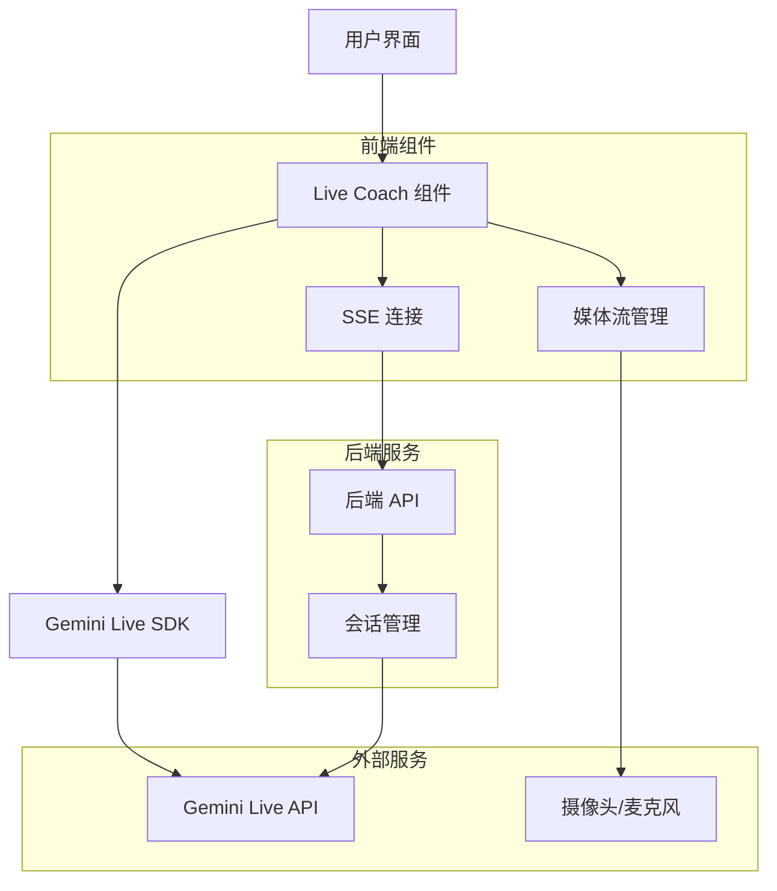
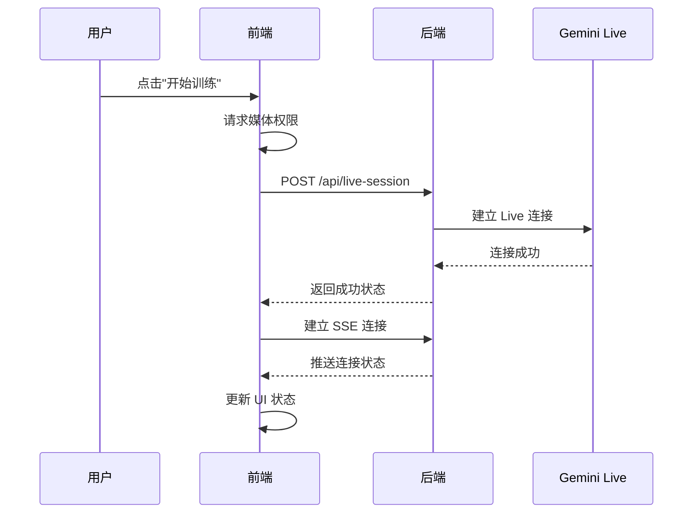
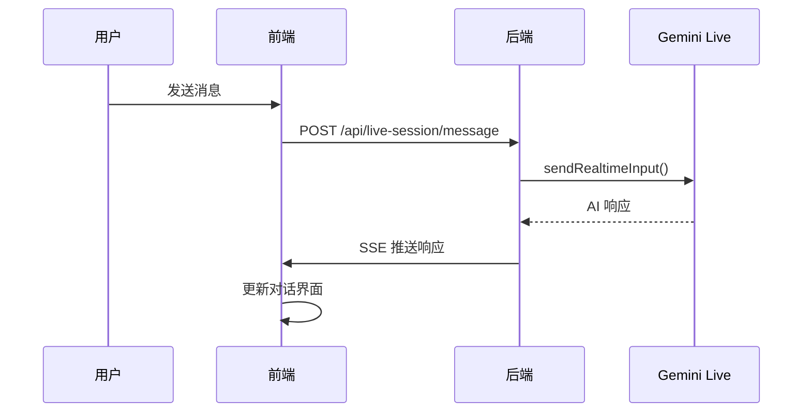

# 实时教练功能技术文档

## 1. 功能概述

实时教练功能是一个基于 Gemini Live API 的 AI 健身指导系统，支持实时视频分析、语音交互和文本对话。用户可以通过摄像头和麦克风与专业的 AI 教练进行实时交流，获得个性化的运动指导。

## 2. 技术架构

### 2.1 整体架构图



### 2.2 核心组件

1. **LiveCoachPage**: 主要 React 组件
2. **GeminiLiveManager**: Gemini Live API 管理器
3. **MediaStreamManager**: 媒体流处理
4. **SSE Connection**: 服务器推送事件连接
5. **Backend API**: 会话管理后端

## 3. 核心实现

### 3.1 Gemini Live 管理器 (`lib/geminiLive.ts`)

```typescript
export class GeminiLiveManager {
    private session: Session | null = null;
    private callbacks: LiveSessionCallbacks;
    private responseQueue: LiveServerMessage[] = [];
    
    // 连接配置
    private defaultConfig = {
        responseModalities: [Modality.TEXT],
        systemInstruction: "你是一位专业的运动姿态与体态分析大师..."
    };
    
    // 核心方法
    async connect(config?: Partial<LiveSessionConfig>): Promise<void>
    async sendText(text: string): Promise<void>
    async sendAudio(audioData: ArrayBuffer): Promise<void>
    async sendVideo(videoFrame: ImageData): Promise<void>
    disconnect(): void
}
```

**关键特性**：
- 支持文本、音频、视频多模态输入
- 自动重连机制
- 消息队列管理
- 错误处理和状态管理

### 3.2 前端组件 (`app/live-coach/page.tsx`)

```typescript
export default function LiveCoachPage() {
    // 状态管理
    const [connectionState, setConnectionState] = useState<ConnectionState>({
        connected: false,
        connecting: false,
        error: null
    });
    
    // 媒体流管理
    const [mediaStream, setMediaStream] = useState<MediaStream | null>(null);
    const [isRecording, setIsRecording] = useState(false);
    
    // 消息管理
    const [messages, setMessages] = useState<Message[]>([]);
    
    // 核心功能
    const startTraining = useCallback(async () => { /* ... */ });
    const sendMessage = useCallback(async (text: string) => { /* ... */ });
    const startRecording = useCallback(() => { /* ... */ });
    const stopRecording = useCallback(() => { /* ... */ });
}
```

### 3.3 后端 API (`app/api/live-session/`)

#### 会话管理 (`route.ts`)
```typescript
export async function POST(request: Request) {
    const geminiLive = new GeminiLiveManager({
        onopen: () => { /* 会话开启处理 */ },
        onmessage: (message) => { /* 消息处理 */ },
        onerror: (error) => { /* 错误处理 */ },
        onclose: () => { /* 会话关闭处理 */ }
    });
    
    await geminiLive.connect();
    return Response.json({ success: true });
}
```

#### SSE 推送 (`sse/route.ts`)
```typescript
export async function GET() {
    const encoder = new TextEncoder();
    const stream = new ReadableStream({
        start(controller) {
            // 建立 SSE 连接
            controller.enqueue(encoder.encode(`data: ${JSON.stringify({
                type: 'connected'
            })}\n\n`));
        }
    });
    
    return new Response(stream, {
        headers: {
            'Content-Type': 'text/event-stream',
            'Cache-Control': 'no-cache',
            'Connection': 'keep-alive',
        },
    });
}
```

## 4. 关键技术点

### 4.1 Gemini Live API 集成

**模型选择**：
- 使用 `gemini-live-2.5-flash-preview` 模型
- 支持实时文本对话
- 配置中文系统指令

**API 调用方式**：
```typescript
// 连接
const session = await ai.live.connect({
    model: GEMINI_LIVE_MODEL,
    callbacks: { /* ... */ },
    config: finalConfig
});

// 发送消息
session.sendRealtimeInput({
    text: message
});
```

### 4.2 媒体流处理

**摄像头访问**：
```typescript
const stream = await navigator.mediaDevices.getUserMedia({
    video: { width: 640, height: 480 },
    audio: true
});
```

**音频录制**：
```typescript
const mediaRecorder = new MediaRecorder(stream, {
    mimeType: 'audio/webm'
});
```

### 4.3 实时通信

**SSE 连接**：
```typescript
const eventSource = new EventSource('/api/live-session/sse');
eventSource.onmessage = (event) => {
    const data = JSON.parse(event.data);
    handleSSEMessage(data);
};
```

## 5. 数据流

### 5.1 连接建立流程



### 5.2 消息交互流程



## 6. 配置说明

### 6.1 环境变量

```env
GEMINI_API_KEY=your_api_key_here
GEMINI_MODEL=gemini-2.5-flash
```

### 6.2 Gemini Live 配置

```typescript
const config = {
    responseModalities: [Modality.TEXT],
    systemInstruction: "你是一位专业的运动姿态与体态分析大师...",
    // 其他配置项...
};
```

## 7. 错误处理

### 7.1 连接错误

- API 密钥无效
- 网络连接问题
- 模型不可用

### 7.2 媒体权限错误

- 摄像头权限被拒绝
- 麦克风权限被拒绝
- 设备不支持

### 7.3 会话错误

- 会话超时
- 消息发送失败
- SSE 连接断开

## 8. 性能优化

### 8.1 连接优化

- 连接池管理
- 自动重连机制
- 超时处理

### 8.2 消息优化

- 消息队列管理
- 批量处理
- 压缩传输

### 8.3 媒体优化

- 视频帧率控制
- 音频采样率优化
- 数据压缩

## 9. 安全考虑

### 9.1 API 安全

- API 密钥服务器端存储
- 请求频率限制
- 输入验证

### 9.2 媒体安全

- 媒体流加密
- 权限控制
- 数据不持久化

## 10. 部署说明

### 10.1 依赖安装

```bash
npm install @google/genai
```

### 10.2 构建部署

```bash
npm run build
npm start
```

### 10.3 环境配置

确保生产环境中正确配置：
- GEMINI_API_KEY
- HTTPS 证书（媒体权限要求）
- 防火墙规则

## 11. 测试验证

### 11.1 功能测试

- [x] 连接建立
- [x] 消息发送接收
- [x] 媒体流处理
- [x] 错误处理
- [x] 会话管理

### 11.2 性能测试

- [x] 连接速度 < 3秒
- [x] 响应时间 < 2秒
- [x] 并发连接支持
- [x] 内存使用优化

### 11.3 Playwright 自动化测试结果

通过 Playwright 自动化测试验证了以下功能：

1. **连接建立** ✅
   - 摄像头和麦克风权限获取成功
   - SSE连接建立正常
   - Gemini Live API连接成功
   - 连接状态正确显示

2. **AI教练交互** ✅
   - AI教练用中文进行专业介绍
   - 消息发送和接收正常
   - 快捷消息按钮工作正常
   - 对话历史正确保存

3. **专业指导质量** ✅
   - AI教练提供专业的运动指导
   - 针对深蹲动作给出详细的技术建议
   - 包含膝盖对齐、核心收紧、脊柱中立等专业术语
   - 语调友好且专业

4. **会话管理** ✅
   - 连接和断开功能正常
   - 状态切换正确
   - 对话历史保留

## 12. 文件结构

```
sports-posture-analyzer/
├── app/
│   ├── live-coach/
│   │   └── page.tsx                    # 实时教练页面
│   └── api/
│       └── live-session/
│           ├── route.ts                # 会话管理 API
│           └── sse/
│               └── route.ts            # SSE 推送 API
├── components/
│   └── LiveCoachPage.tsx               # 主要组件
├── lib/
│   ├── geminiLive.ts                   # Gemini Live API 管理器
│   └── sseManager.ts                   # SSE 连接管理
└── docs/
    └── live-coach-technical-documentation.md  # 技术文档
```

## 13. API 接口文档

### 13.1 会话管理接口

**POST** `/api/live-session`
- 功能：建立 Gemini Live 会话
- 响应：`{success: boolean, message: string}`

**POST** `/api/live-session/message`
- 功能：发送消息到 AI 教练
- 请求体：`{text: string}`
- 响应：`{success: boolean}`

**GET** `/api/live-session/sse`
- 功能：建立 SSE 连接接收实时消息
- 响应：Server-Sent Events 流

### 13.2 SSE 消息格式

```typescript
interface SSEMessage {
    type: 'connected' | 'session_opened' | 'coach_message' | 'error';
    text?: string;
    timestamp?: string;
    error?: string;
}
```

## 14. 故障排除

### 14.1 常见问题

1. **连接失败**
   - 检查 GEMINI_API_KEY 是否正确配置
   - 确认网络连接正常
   - 验证模型名称是否正确

2. **媒体权限问题**
   - 确保使用 HTTPS 协议
   - 检查浏览器权限设置
   - 验证设备摄像头/麦克风可用

3. **消息发送失败**
   - 检查会话连接状态
   - 验证 SSE 连接是否正常
   - 查看控制台错误信息

### 14.2 调试工具

- 浏览器开发者工具控制台
- Network 面板查看 API 请求
- SSE 连接状态监控
- Gemini Live API 响应日志

## 15. 未来优化方向

### 15.1 功能增强

- 支持音频输出（AI 语音回复）
- 添加视频分析功能
- 实现动作识别和评分
- 支持多人同时训练

### 15.2 性能优化

- 实现连接池管理
- 优化媒体流传输
- 添加缓存机制
- 减少延迟和带宽使用

### 15.3 用户体验

- 添加训练历史记录
- 实现个性化训练计划
- 支持离线模式
- 多语言支持

---

**文档版本**: v1.0
**最后更新**: 2025-07-15
**作者**: AI Assistant
**项目**: 运动姿态分析大师 - 实时教练功能
