# 系统工作流程说明

本文档阐述了用户从上传视频到最终获取运动姿态分析结果的【当前系统】完整流程。

## 一、视频上传与分析任务提交 (前端主导)

1.  **文件选择与初步校验:**
    *   用户在Web界面选择一个视频文件。
    *   前端 (`useVideoAnalysis` Hook) 进行初步的文件大小检查 (当前设定最大5GB)。

2.  **请求安全上传URL:**
    *   前端调用后端API `POST /api/generate-upload-url`，参数包含 `fileName` 和 `fileType`。
    *   **后端行为:** 此API与R2云存储服务通信，生成一个预签名URL。该URL授予客户端将文件直接上传到R2中特定位置的临时安全权限。
    *   API返回 `uploadUrl` (用于上传到R2的预签名URL) 和 `publicUrl` (上传后视频可访问的永久URL)。

3.  **文件直接上传至R2存储:**
    *   前端使用获取到的 `uploadUrl`，将视频文件直接上传到Cloudflare R2存储。这通常是一个对R2的 `PUT` 请求。
    *   这种直接上传方式减轻了后端服务器的带宽和处理压力。

4.  **提交分析任务:**
    *   R2上传成功后，前端调用后端API `POST /api/submit-video-url`。
    *   请求体包含视频在R2上的 `publicUrl`、`fileName` 和 `fileType`。
    *   **后端行为:**
        *   API验证请求的有效性。
        *   在数据库 (Supabase) 中创建一个分析事件记录，初始状态通常为 "pending"。
        *   使用 `lib/jobStorage.ts` 在内存中创建一个任务条目，记录初始状态和信息。
        *   API【异步调用】`lib/genai.ts` 中的 `performAnalysisFromUrl` 函数来【启动后台分析过程】。此函数会在其自己的执行流程中处理后续步骤。
        *   API向前端返回一个 `job_id` (用于前端轮询) 和数据库事件 `db_event_id`，并立即以 202 Accepted 状态响应，表明请求已被接受并将进行处理。
    *   前端更新UI，提示用户分析任务已提交并处于 "等待中" 状态。

## 二、后端处理 (API内异步执行)

【此阶段描述的是由 `/api/submit-video-url` 或 `/api/jobs/[jobId]/retry` 路由异步调用的 `performAnalysisFromUrl` 函数 (位于 `lib/genai.ts`) 的内部逻辑。当前系统没有独立的 Worker 进程或专用的消息队列服务。】

1.  **任务状态更新 (处理中):**
    *   `performAnalysisFromUrl` 函数开始执行后，会首先更新 `lib/jobStorage.ts` 中对应任务的状态为 "processing"。
    *   同时，也会尝试更新 Supabase 数据库中对应分析事件的状态。

2.  **视频获取与分析:**
    *   函数从 R2 (`publicUrl`) 下载视频文件到服务器的临时存储。
    *   更新 `jobStorage` 中的状态，指明正在下载或已下载。
    *   调用 `performAnalysisWithLocalFile` (同样在 `lib/genai.ts`):
        *   将本地临时视频文件上传到 Google Gemini。
        *   更新 `jobStorage` 状态，并更新 Supabase 中对应的 Gemini 文件链接。
        *   等待 Gemini 服务处理上传的文件。
        *   调用 Google Gemini API 对视频进行姿态分析。
        *   更新 `jobStorage` 状态，指明正在分析。

3.  **存储分析结果:**
    *   分析完成后，从 Gemini API 获取分析报告。
    *   将包含文本报告和时间戳的分析结果保存在 `jobStorage` 中。

4.  **更新任务状态 (最终状态):**
    *   在 `jobStorage` 中将任务状态更新为 "completed"。
    *   调用 Supabase API (`completeAnalysisEvent`) 将完整的分析报告和 "completed" 状态保存到数据库。
    *   如果过程中任何步骤失败，则在 `jobStorage` 和 Supabase 中将状态更新为 "failed"，并记录错误信息。
    *   清理服务器上的临时视频文件。

## 三、历史记录与结果展示 (前端)

1.  **获取分析历史:**
    *   `AnalysisHistory` 组件 (`app/history/page.tsx` -> `components/AnalysisHistory.tsx`) 使用 `useAnalysisHistory` Hook (`lib/hooks.ts`)。
    *   此Hook调用后端API `GET /api/analysis-history`。
    *   **后端行为:** 此API从 Supabase 数据库中查询当前用户的分析任务列表，包括其 `id`, `r2_video_link`, `created_at`, `status`, `error_message`, 以及 (如果已完成) `analysis_report`。
    *   `useAnalysisHistory` Hook 每5秒自动轮询此API端点，以获取所有任务的最新状态。

2.  **获取单个任务的最新状态 (用于页面刷新或直接访问结果页时的轮询):**
    *   前端也可能使用 `useJobPolling` Hook，它调用 `GET /api/results/[jobId]`。
    *   **后端行为:** 此 API 从 `lib/jobStorage.ts` 的内存存储中获取特定 `jobId` 的当前状态和结果（如果可用）。【注意：这里的状态可能比数据库中的更实时，但也可能在服务器重启时丢失。】

3.  **展示状态与结果:**
    *   前端渲染任务列表，展示：
        *   视频预览。
        *   创建时间。
        *   当前状态 (如 "等待中", "处理中", "已完成", "失败")，并配以合适的UI样式。
        *   若任务已完成，显示 "查看报告" 按钮，点击后展示 `analysis_report.text` (通常来自 `analysis-history` 的数据库数据)。
        *   若任务失败，显示错误信息和 "重试" 按钮。

## 四、任务重试机制

1.  **用户发起重试:**
    *   如果某个任务状态为 "failed"，用户可以点击 "重试" 按钮。

2.  **重试请求:**
    *   前端 (`AnalysisHistory.tsx` -> `useJobRetry` Hook) 调用后端API: `POST /api/jobs/[jobId]/retry`。
    *   **后端行为:**
        *   API 根据 `jobId` 从 Supabase 数据库获取原始任务详情。
        *   验证任务确实处于 "failed" 状态。
        *   更新数据库中该任务的状态为 "pending" (或类似的待重试状态)，并清除之前的错误信息。
        *   生成一个新的内部处理 `processingJobId`，并在 `lib/jobStorage.ts` 中为此新 ID 设置初始任务状态。
        *   API【异步调用】`lib/genai.ts` 中的 `performAnalysisFromUrl` 函数，使用原始视频 URL 【重新启动完整的后台分析过程】。
        *   API 向前端返回原始 `jobId` 和新的 `processingJobId`，并以 202 Accepted 状态响应。
    *   前端UI更新，显示任务正在重试。常规的轮询机制 (通过 `GET /api/analysis-history`) 最终会反映任务的新状态。

## 五、系统流程图

```mermaid
flowchart LR
    User[User Browser] --> API_GenerateURL[API /generate-upload-url];
    API_GenerateURL --> R2_SignURL[R2 Sign URL];
    R2_SignURL --> User_Upload[User Upload to R2];
    User_Upload --> API_SubmitURL[API /submit-video-url];
    
    API_SubmitURL --> DB_CreateJob[Supabase Create Job Pending];
    DB_CreateJob --> MemStore_Create[InMemoryStore Create Job Pending];
    MemStore_Create --> AsyncFunc_Start[Call Async performAnalysisFromUrl];
    AsyncFunc_Start -.-> API_SubmitURL_Ack[API Return 202 Accepted];

    subgraph AsyncAnalysis [lib/genai.ts performAnalysisFromUrl]
        direction TB
        AsyncFunc_Start_Internal[Start Analysis] --> DownloadVideo[Download from R2];
        DownloadVideo --> MemStore_Update1[MemStore Status Downloading];
        DownloadVideo --> R2_ActualDownload[R2 Get Video];
        R2_ActualDownload --> UploadToAI[Upload to GenAI];
        UploadToAI --> MemStore_Update2[MemStore Status Uploading GenAI];
        UploadToAI --> GenAI_Upload[GenAI Store File];
        GenAI_Upload --> DB_UpdateLink[Supabase Update GenAI Link];
        DB_UpdateLink --> WaitGenAI[Wait GenAI Processing];
        WaitGenAI --> GenAI_Analyze[GenAI Analyze Video];
        GenAI_Analyze --> MemStore_Update3[MemStore Status Analyzing];
        MemStore_Update3 --> StoreResults[Process and Store Results];
        StoreResults --> MemStore_Final[MemStore Status Done/Failed Save Report];
        StoreResults --> DB_Final[Supabase Status Done/Failed Save Report];
        DB_Final --> Cleanup[Cleanup Temp Files];
    end
    AsyncFunc_Start --> AsyncFunc_Start_Internal;

    User_Polls[User Polls /api/analysis-history] --> API_GetHistory[API /api/analysis-history];
    API_GetHistory --> DB_ReadHistory[Supabase Read Job History];
    DB_ReadHistory --> User_Polls_Update[User Updates UI];

    User_Retries[User Clicks Retry] --> API_RetryJob[API /jobs/jobId/retry];
    API_RetryJob --> DB_ResetJob[Supabase Reset Job to Pending];
    DB_ResetJob --> MemStore_Retry[InMemoryStore Update Job Pending];
    MemStore_Retry --> AsyncFunc_Start_Retry[Call Async performAnalysisFromUrl];
    AsyncFunc_Start_Retry -.-> API_RetryJob_Ack[API Return 202 Accepted];
    AsyncFunc_Start_Retry --> AsyncFunc_Start_Internal;

    User_Sees_Report[User Views Report];
    User_Polls_Update --> User_Sees_Report;
```

